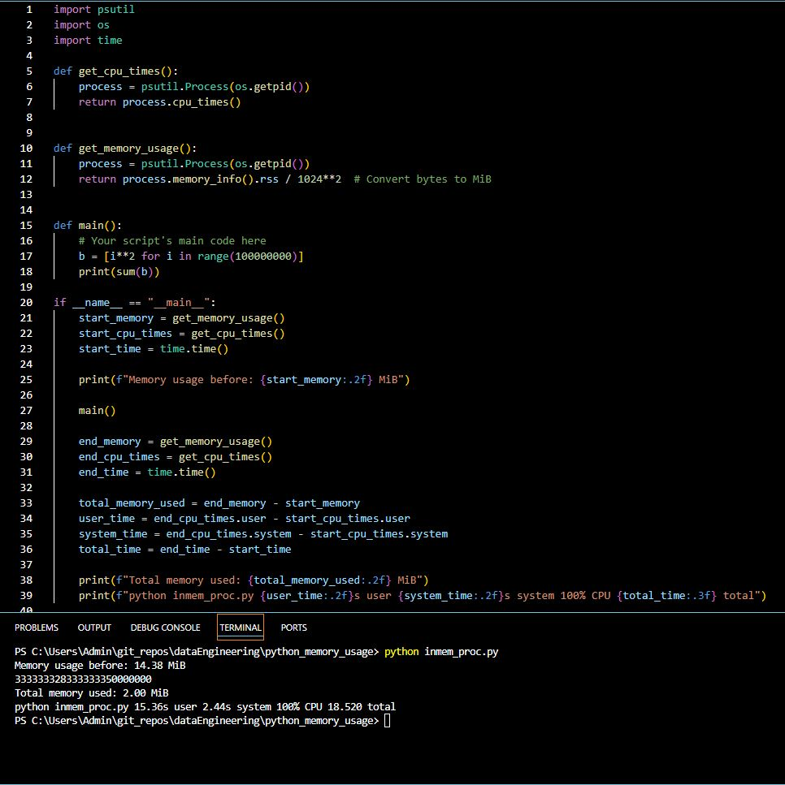
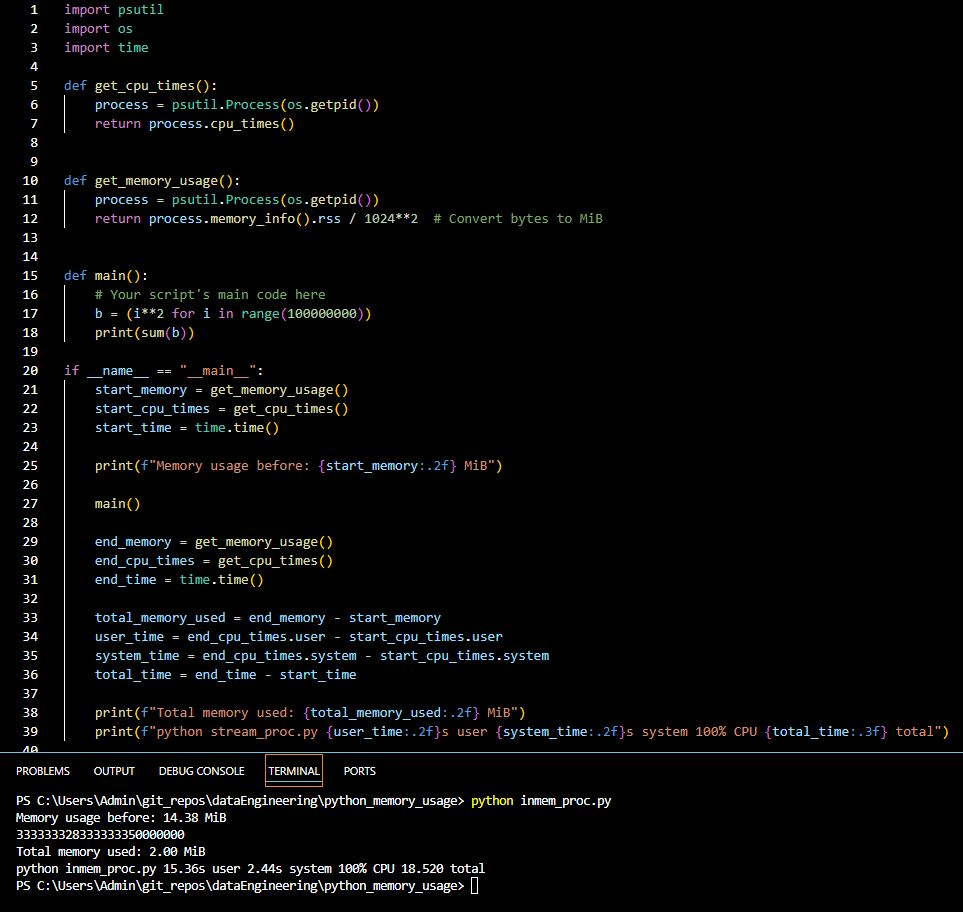

# **List vs. Generator Expression: Leveraging Generators for Efficient Large Dataset Processing**

## **Introduction** 

In the realm of data processing and computational efficiency, Python offers a powerful feature known as generators. When dealing with large datasets, whether in data science, computational algorithms, or even simple iterative tasks, the choice between using a list and a generator can profoundly impact both memory usage and computational speed.


## **The Challenge of Large Datasets**

Large datasets present a dual challenge: they require significant memory to store and can demand substantial processing time to manipulate. Traditionally, Python lists serve as versatile containers, allowing for efficient access and manipulation of elements. However, their drawback lies in their need to precompute and store all elements in memory simultaneously. This upfront memory allocation can become prohibitive as dataset sizes grow into millions or even billions of elements.


## **Enter Generators: On-Demand Computation**

Generators offer an elegant solution to mitigate these challenges. Unlike lists that store all elements immediately upon creation, generators produce elements lazily and on-demand. This means that instead of precomputing and storing all dataset elements, generators compute each element only when requested, typically one at a time. This approach drastically reduces the initial memory overhead because only a small amount of data is held in memory at any given moment.


## **Memory Efficiency**

By minimizing the amount of data held in memory concurrently, generators allow Python programs to handle extraordinarily large datasets that would otherwise exceed available memory limits. This efficiency not only optimizes memory usage but also enhances the program's ability to scale gracefully with increasing dataset sizes.


## **Performance Considerations**

While generators may incur a slight performance overhead due to the dynamic computation of each element, the trade-off in memory savings often translates into faster overall execution times. This is particularly advantageous in scenarios where memory constraints are a limiting factor or where the dataset size is too vast to fit comfortably into available memory.


## **Use Cases and Practical Applications**

Generators find wide applicability across various domains:

- **Data Streaming and Pipelining:** Processing data streams where data is read or generated continuously without needing to store it all in memory.

- **Efficient Iteration:** Iterating over large files or databases where loading everything into memory at once is impractical.

- **Complex Computations:** Performing complex computations where intermediate results can be generated as needed, rather than precomputed and stored.

## **Prcatical Example**

In the example below, I show how `generators` perform better than `list` expressions.




### **List:**

- **Definition:** A list in Python is a collection of elements stored in memory.

- **Memory Usage:** When I create a list with [i**2 for i in range(100000000)], Python computes all the squares and stores them in memory immediately. This means it requires a large amount of memory because it has to store 100 million integers all at once.

- **Time Usage:** Lists can be faster to access since all elements are readily available in memory, but creating such a large list takes significant time and memory.


The following is a break down of what the `**inmem_proc.py**` script does step-by-step:

#### 1. Importing Necessary Modules

I start by importing the tools I need:

- `**psutil**`: Helps me get information about the running program, like memory and CPU usage.
- `**os**`: Gives me access to information about the operating system, like the process ID.
- `**time**`: Helps me measure how long my program takes to run.

```python
import psutil
import os
import time

```

#### 2. Getting Memory Usage

I have a function that tells me how much memory (RAM) my program is using. It converts this number from bytes (very small units) to megabytes (MiB, which are bigger and easier to understand).

```python
def get_memory_usage():
    process = psutil.Process(os.getpid())
    return process.memory_info().rss / 1024**2  # Convert bytes to MiB

```

#### 3. Getting CPU Times

This function tells me how much time the CPU (the brain of the computer) spends working on my program.

```python
def get_cpu_times():
    process = psutil.Process(os.getpid())
    return process.cpu_times()

```

#### 4. Main Part of Our Program

Here’s where I do the main work of the program. In this case, I'm creating a big list of numbers (squares of numbers from 0 to 99,999,999) and then adding them all up.

```python
def main():
    b = [i**2 for i in range(100000000)]
    print(sum(b))
```


#### 5. Running and Measuring the Program

Now, I put everything together:

- I check how much memory I'm using before starting the main work.
- I check how much CPU time I'm used before starting.
- I check the clock time before starting.

```python
if __name__ == "__main__":
    start_memory = get_memory_usage()
    start_cpu_times = get_cpu_times()
    start_time = time.time()
    
    print(f"Memory usage before: {start_memory:.2f} MiB")

```


#### 6. Running the Main Work

I then run the main part of our program.

```python
    main()

```


#### 7. Checking Usage After Running

After running the main work, I check the memory, CPU times, and clock time again.

```python
    end_memory = get_memory_usage()
    end_cpu_times = get_cpu_times()
    end_time = time.time()

```


#### 8. Calculating and Printing the Results

I calculate how much memory was used, how much CPU time was used, and how much total time passed. Then I print these results.

```python
    total_memory_used = end_memory - start_memory
    user_time = end_cpu_times.user - start_cpu_times.user
    system_time = end_cpu_times.system - start_cpu_times.system
    total_time = end_time - start_time
    
    print(f"Total memory used: {total_memory_used:.2f} MiB")
    print(f"python inmem_proc.py {user_time:.2f}s user {system_time:.2f}s system 100% CPU {total_time:.3f} total")

```


#### Summary

- I start by noting how much memory and CPU time we're using.
- I do some heavy computation (squaring numbers and summing them up).
- I check again how much memory and CPU time we're using.
- I calculate the differences and print them out to see how much work was done.
- This way, I know exactly how much memory and time our program used to do its job!


### **Generator Expression:**




- **Definition:** A generator expression (or generator) produces items one at a time and only when needed.

- **Memory Usage:** When I use (i**2 for i in range(100000000)), Python doesn't store all the numbers in memory at once. Instead, it generates each number on the fly when needed by the sum() function. This results in very low memory usage because it doesn't need to store the entire list of numbers in memory.

- **Time Usage:** Generators are usually slower for accessing elements since they generate each element on the fly. However, they are much more memory efficient because they don’t need to store the entire dataset in memory.


### **The Modified Script Explained**

When I used a list:

```python
b = [i**2 for i in range(100000000)]
print(sum(b))

```
- **Memory:** This line creates a list of 100 million squared numbers, using a large amount of memory.

- **Time:** Creating this list takes time, and storing such a large list in memory can slow down the program due to memory management overhead.


However, When I used a generator expression:

```python
b = (i**2 for i in range(100000000))
print(sum(b))

```

- **Memory:** This line creates a generator that generates each squared number one at a time, using very little memory.

- **Time:** While it might take a bit longer to generate each number on the fly, the overall time can be less due to the reduced memory management overhead.


#### **Summary**

- **Memory Efficiency:** Generators are much more memory efficient than lists for large datasets because they don't store all elements in memory at once.

- **Time Efficiency:** Generators can sometimes be slower for accessing elements because each element is computed on the fly. However, for very large datasets, the reduced memory usage can lead to overall faster execution due to less memory management overhead.

In this case, using a generator expression instead of a list led to significant reductions in both memory usage and total execution time, especially given the large size of the dataset you were processing. This efficiency is why the memory usage was only 2 MiB with the generator expression compared to much higher with the list, and the execution time was also reduced.


## **Conclusion**

In conclusion, the choice between using generators and lists hinges on the specific requirements of the task at hand. For scenarios involving large datasets or constrained memory environments, generators offer a compelling advantage in terms of both memory efficiency and scalability. By adopting generators, Python developers can optimize their programs to handle massive datasets with minimal memory footprint and improved computational efficiency, thereby unlocking new possibilities in data-intensive applications.
